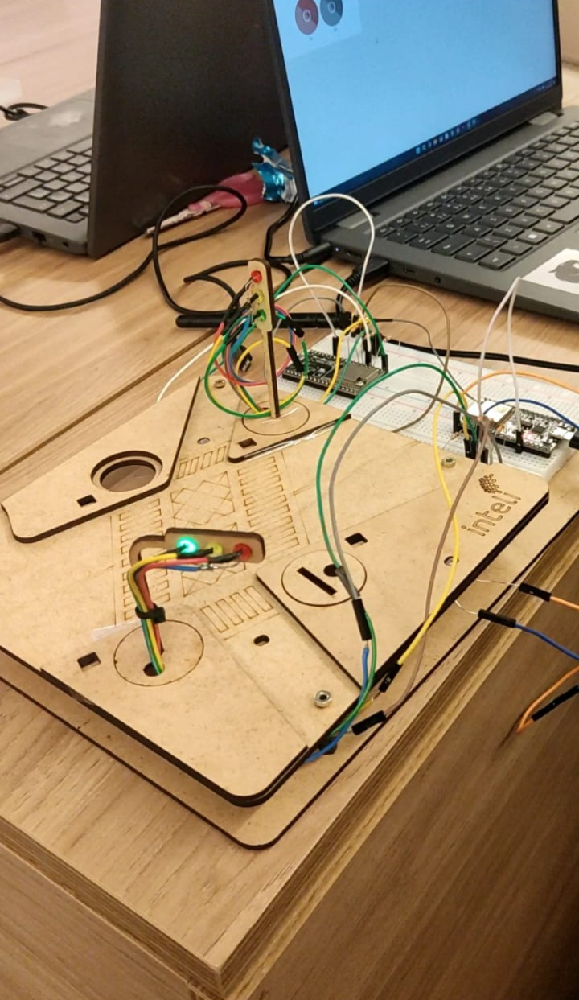

# Projeto de Semáforo Inteligente para Smart Cities

## Introdução
Nesta atividade ponderada, nos foi atribuído o desafio de desenvolver um sistema de semáforo inteligente, que simula a visão de uma Smart City onde semáforos não apenas controlam o tráfego, mas também se comunicam entre si para ajustar o fluxo de veículos de forma autônoma e eficiente. O sistema utiliza um sensor LDR (Light Dependent Resistor) para detectar a presença de veículos com base em variações de luminosidade e adotar um comportamento adequado para diferentes condições, incluindo um "modo noturno". Este documento descreve o processo de montagem, programação e integração do semáforo com a plataforma Ubidots, oferecendo uma visão prática do conceito de cidades inteligentes.

## Estrutura do Projeto
- **Parte 1: Montagem Física e Programação do LDR**  
  Nesta etapa, foram montados dois semáforos conectados ao sensor LDR, que detecta a passagem de veículos simulados através da variação de luz. O sistema foi configurado para mudar automaticamente para o modo noturno quando a luminosidade cai abaixo de um certo limite, ajustando os LEDs de acordo com as condições.
  
- **Parte 2: Configuração da Interface Online**  
  A interface foi configurada para possibilitar o ajuste remoto do semáforo e visualização das leituras do sensor LDR. Utilizamos o Ubidots para centralizar e monitorar os dados em tempo real, o que ajuda na gestão inteligente do fluxo de tráfego.

- **Extra: Implementação com ESP32 e Ubidots**  
  Cada semáforo foi conectado a um ESP32, permitindo a comunicação com o dashboard do Ubidots. Isso facilita o gerenciamento e controle remoto dos semáforos, embora a interface final ainda necessite de melhorias para torná-la mais responsiva.

---

## Documentação do Protótipo

### Montagem e Programação
<div align="center">
<sub>Figura 1 - atividade </sub><br>
<br>
<sup>Fonte: Material produzido pelos autores (2024)</sup></div>

[Assista ao vídeo demonstrativo](https://youtube.com/shorts/yCTKtU2RNfo?si=DzkuWeKB-g9GdwfM)


### Explicação Geral
Utilizamos um sensor LDR para detectar a intensidade de luz, permitindo que o sistema mude para um modo noturno quando a luminosidade está abaixo do limite pré-definido. Para os LEDs do semáforo, configuramos um ciclo de alternância entre vermelho, amarelo e verde, com intervalos específicos para simular o controle de tráfego. A integração com o Ubidots permite monitorar remotamente o modo do semáforo e os valores capturados pelo sensor, além de ativar o modo noturno manualmente, se necessário.

### Código-Fonte e Explicação

#### Código
```cpp
#include <WiFi.h>
#include <UbidotsEsp32Mqtt.h>

// Definição dos pinos e variáveis
#define LDR_PIN 34          // Pino do sensor LDR no ESP32
#define RED_PIN 27          // Pino do LED vermelho
#define YELLOW_PIN 32       // Pino do LED amarelo
#define GREEN_PIN 33        // Pino do LED verde
#define THRESHOLD 500       // Limite de luminosidade para ativar o modo noturno
#define VARIABLE_LDR "luminosidade"     // Nome da variável de luminosidade no Ubidots
#define VARIABLE_MODE "modo_noturno"    // Nome da variável de modo noturno no Ubidots
#define VARIABLE_YELLOW_OVERRIDE "botao_dashboard" // Nome da variável para o botão no dashboard

// Credenciais para conexão com o Ubidots e Wi-Fi
const char *UBIDOTS_TOKEN = "BBUS-veCoBVrAsiykWhV0az7GqtT7AnbTQx"; // Token do Ubidots
const char *WIFI_SSID = "Inteli.Iot";     // Nome da rede Wi-Fi
const char *WIFI_PASS = "@Intelix10T#";   // Senha da rede Wi-Fi
const char *DEVICE_LABEL = "esp32_t12_g01"; // Nome do dispositivo no Ubidots

// Instância do cliente MQTT do Ubidots
Ubidots ubidots(UBIDOTS_TOKEN);

// Variáveis de controle
bool modoNoturno = false;                   // Indica se o modo noturno está ativado
bool luminosidadeAtivada = true;            // Indica se a luminosidade está ativada
bool estadoModoNoturnoPublicado = true;     // Controle para evitar publicação repetida do estado do modo noturno
bool estadoLuminosidadePublicado = true;    // Controle para evitar publicação repetida do estado da luminosidade
bool yellowOverride = false;                // Controle para ativar/desativar o modo amarelo fixo
unsigned long previousMillis = 0;           // Usado para controle de tempo na lógica de LEDs
unsigned long interval = 5000;              // Intervalo para alternar LEDs
int lightState = 0;                         // Estado atual da sequência dos LEDs

// Callback executado quando uma mensagem é recebida do Ubidots
void callback(char *topic, byte *payload, unsigned int length) {
  // Exibe o tópico recebido
  Serial.print("Tópico recebido: ");
  Serial.println(topic);

  // Converte o payload (dados recebidos) em uma string
  String message = "";
  for (int i = 0; i < length; i++) {
    message += (char)payload[i];
  }
  Serial.print("Mensagem recebida no Ubidots: ");
  Serial.println(message);

  // Converte a mensagem em um valor numérico
  float value = message.toFloat();
  Serial.print("Valor convertido: ");
  Serial.println(value);

  // Atualiza o estado do modo noturno com base no tópico recebido
  if (String(topic).endsWith(VARIABLE_MODE)) {
    modoNoturno = (value == 1.0);
    estadoModoNoturnoPublicado = false; // Marca que o estado deve ser publicado
    Serial.print("Modo noturno atualizado para: ");
    Serial.println(modoNoturno ? "Ativado" : "Desativado");
  }

  // Atualiza o estado da luminosidade com base no tópico recebido
  if (String(topic).endsWith(VARIABLE_LDR)) {
    luminosidadeAtivada = (value == 1.0);
    estadoLuminosidadePublicado = false; // Marca que o estado deve ser publicado
    Serial.print("Luminosidade atualizada para: ");
    Serial.println(luminosidadeAtivada ? "Ativada" : "Desativada");
  }

  // Alterna o estado do modo amarelo fixo com base no botão do dashboard
  if (String(topic).endsWith(VARIABLE_YELLOW_OVERRIDE)) {
    yellowOverride = !yellowOverride; // Alterna o estado
    Serial.print("Modo amarelo fixo atualizado para: ");
    Serial.println(yellowOverride ? "Ativado" : "Desativado");
  }
}

// Função para conectar ao Wi-Fi
void connectWiFi() {
  WiFi.begin(WIFI_SSID, WIFI_PASS);
  Serial.print("Conectando ao WiFi...");
  while (WiFi.status() != WL_CONNECTED) {
    Serial.print(".");
    delay(1000);
  }
  Serial.println(" Conectado ao WiFi!");
}

// Função para conectar ao MQTT e inscrever-se nos tópicos do Ubidots
void connectMQTT() {
  while (!ubidots.connected()) {
    Serial.print("Conectando ao Ubidots MQTT...");
    ubidots.reconnect();
    Serial.println("Conectado ao Ubidots.");
    
    // Inscreve-se nas variáveis do Ubidots
    ubidots.subscribeLastValue(DEVICE_LABEL, VARIABLE_MODE);
    ubidots.subscribeLastValue(DEVICE_LABEL, VARIABLE_LDR);
    ubidots.subscribeLastValue(DEVICE_LABEL, VARIABLE_YELLOW_OVERRIDE);
    Serial.println("Inscrito nas variáveis modo_noturno, luminosidade e botao_dashboard.");
  }
}

// Função para publicar dados no Ubidots
void publishData() {
  // Lê o valor do LDR
  int ldrValue = analogRead(LDR_PIN);

  // Adiciona o valor da luminosidade à variável do Ubidots
  ubidots.add(VARIABLE_LDR, ldrValue);

  // Publica o estado do modo noturno, se necessário
  if (!estadoModoNoturnoPublicado) {
    ubidots.add(VARIABLE_MODE, modoNoturno ? 1 : 0);
    estadoModoNoturnoPublicado = true;
  }

  // Publica o estado da luminosidade, se necessário
  if (!estadoLuminosidadePublicado) {
    ubidots.add(VARIABLE_LDR, luminosidadeAtivada ? 1 : 0);
    estadoLuminosidadePublicado = true;
  }

  // Envia os dados para o Ubidots
  if (ubidots.publish(DEVICE_LABEL)) {
    Serial.println("Dados publicados com sucesso!");
  } else {
    Serial.println("Falha ao publicar os dados.");
  }
}

// Função de configuração
void setup() {
  Serial.begin(115200);

  // Define os pinos dos LEDs e do LDR
  pinMode(LDR_PIN, INPUT);
  pinMode(RED_PIN, OUTPUT);
  pinMode(YELLOW_PIN, OUTPUT);
  pinMode(GREEN_PIN, OUTPUT);

  // Configura a conexão Wi-Fi e MQTT
  ubidots.setDebug(true);
  connectWiFi();
  ubidots.setCallback(callback);
  ubidots.setup();
  connectMQTT();
}

// Função para controlar os LEDs
void controlarLEDs(int ldrValue) {
  // Prioriza o modo amarelo fixo se ativado
  if (yellowOverride) {
    Serial.println("Modo Amarelo Fixo: Apenas LED amarelo aceso.");
    digitalWrite(RED_PIN, LOW);
    digitalWrite(YELLOW_PIN, HIGH);
    digitalWrite(GREEN_PIN, LOW);
    return;
  }

  // Controla o modo noturno
  if (modoNoturno) {
    Serial.println("Modo Noturno Ativado: Apenas LED amarelo aceso.");
    digitalWrite(RED_PIN, LOW);
    digitalWrite(YELLOW_PIN, HIGH);
    digitalWrite(GREEN_PIN, LOW);
    return;
  }

  // Desativa os LEDs se a luminosidade estiver desativada
  if (!luminosidadeAtivada) {
    Serial.println("Luminosidade desativada: Todos os LEDs apagados.");
    digitalWrite(RED_PIN, LOW);
    digitalWrite(YELLOW_PIN, LOW);
    digitalWrite(GREEN_PIN, LOW);
    return;
  }

  // Controla os LEDs com base no valor do LDR
  if (ldrValue < THRESHOLD) {
    Serial.println("Modo automático: LED amarelo aceso devido à baixa luminosidade.");
    digitalWrite(RED_PIN, LOW);
    digitalWrite(YELLOW_PIN, HIGH);
    digitalWrite(GREEN_PIN, LOW);
    return;
  }

  // Alterna entre os LEDs em sequência
  unsigned long currentMillis = millis();
  if (currentMillis - previousMillis >= interval) {
    previousMillis = currentMillis;

    switch (lightState) {
      case 0: // LED vermelho aceso
        digitalWrite(RED_PIN, HIGH);
        digitalWrite(YELLOW_PIN, LOW);
        digitalWrite(GREEN_PIN, LOW);
        lightState = 1;
        break;
      case 1: // LED verde aceso
        digitalWrite(RED_PIN, LOW);
        digitalWrite(YELLOW_PIN, LOW);
        digitalWrite(GREEN_PIN, HIGH);
        lightState = 2;
        break;
      case 2: // LED amarelo aceso
        digitalWrite(RED_PIN, LOW);
        digitalWrite(YELLOW_PIN, HIGH);
        digitalWrite(GREEN_PIN, LOW);
        lightState = 0;
        break;
    }
  }
}

// Função principal de execução contínua
void loop() {
  // Reconecta ao MQTT se necessário
  if (!ubidots.connected()) {
    connectMQTT();
  }
  ubidots.loop();

  // Lê o valor do LDR
  int ldrValue = analogRead(LDR_PIN);

  // Controla os LEDs
  controlarLEDs(ldrValue);

  // Publica os dados no Ubidots
  publishData();
}

```

**1. Introdução ao Código**:  
O programa utiliza um ESP32 para criar um semáforo inteligente conectado ao Ubidots via MQTT. O dispositivo lê dados de um sensor LDR para medir a luminosidade ambiente, alterando o comportamento do semáforo automaticamente com base na luz detectada e nos comandos enviados pelo dashboard.

---

**2. Novidades e Ajustes no Código**:  
**a) Modo Noturno Baseado em Luminosidade**  
Quando o sensor LDR detecta um valor abaixo do limite definido por `THRESHOLD`, o modo noturno é ativado automaticamente. Isso é indicado com o LED amarelo piscando.  
- Se ativado manualmente via o Ubidots, a lógica é sobreposta pelo valor recebido pelo callback.

**b) Botão Dashboard para Modo "Amarelo Fixo"**  
Adicionada funcionalidade que permite ativar ou desativar o modo de "amarelo fixo" diretamente pelo dashboard do Ubidots (`VARIABLE_YELLOW_OVERRIDE`).  
- Quando ativado, todos os outros LEDs são desligados, e apenas o LED amarelo permanece ligado continuamente.

**c) Ciclo de Cores Dinâmico no Semáforo**  
Durante o modo diurno (quando luminosidade está acima do limite):  
- Os LEDs alternam automaticamente entre vermelho, verde e amarelo em intervalos definidos pela variável `interval` (5 segundos por padrão).

---

**3. Conexão com Ubidots**:  
O código estabelece uma conexão MQTT com o Ubidots e permite monitorar e controlar remotamente:  
- **`luminosidade`**: Envia os dados do sensor LDR em tempo real para visualização no dashboard.  
- **`modo_noturno`**: Publica o estado atual do modo noturno, ajustável manualmente.  
- **`botao_dashboard`**: Recebe comandos do botão no dashboard para ativar/desativar o modo amarelo fixo.

---

**4. Função de Controle de LEDs**  
A lógica para ligar e desligar os LEDs está organizada para priorizar modos especiais:  
1. **Modo Amarelo Fixo**: Sempre tem a maior prioridade, acionado manualmente via botão.  
2. **Modo Noturno**: Ativado automaticamente ou pelo Ubidots, desliga todos os LEDs, exceto o amarelo.  
3. **Modo Diurno Automático**: Alterna LEDs baseando-se em uma sequência configurada.  


### Conclusão
Este projeto demonstrou uma aplicação prática para sistemas inteligentes de controle de tráfego, onde o semáforo ajusta o fluxo de veículos baseado em dados de luminosidade. A integração com o Ubidots provou ser um recurso importante para monitoramento e controle remoto, destacando o papel das IoT e Smart Cities na automação de infraestruturas urbanas.
